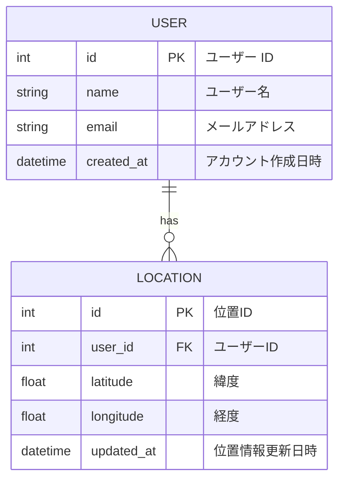

```mermaid
erDiagram
    USER {
      int id PK "ユーザー ID"
      string name "ユーザー名"
      string email "メールアドレス"
      datetime created_at "アカウント作成日時"
    }

    LOCATION {
        int id PK "位置ID"
        int user_id FK "ユーザーID"
        float latitude "緯度"
        float longitude "経度"
        datetime updated_at "位置情報更新日時"
    }

    USER ||--o{ LOCATION : "has"

```
